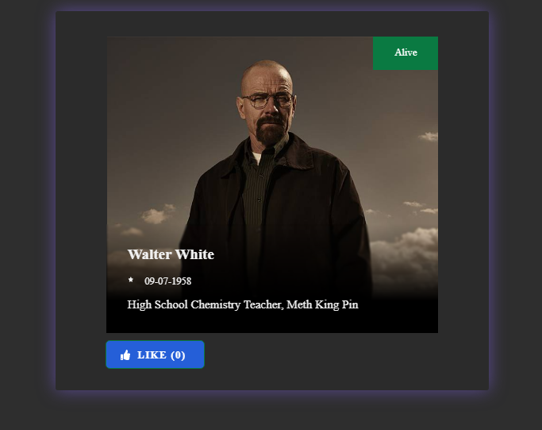

<h1 align="center">
  Challenge Rock Content
    
  
</h1>

  <a href="#tecnologias-utilizadas">Tecnologias utilizadas</a> |
  <a href="#como-usar">Como Usar</a>

Este projeto foi dividido em duas partes, sendo o backend feito em Net. Core 3.1 e o frontend desenvolvido em ReactJS.

## Tecnologias utilizadas

- [axios](https://github.com/axios/axios)
- [prop-types](https://github.com/facebook/prop-types)
- [react](https://github.com/facebook/react)
- [styled-components](https://github.com/styled-components/styled-components)

## Como usar

Pré-requisitos:

- Yarn/Npm
- [Back-end](https://github.com/julio0345/challenge/backend) da aplicação rodando

Instalar as bibliotecas de terceiros rodando no terminal:
> npm install
OU
> yarn

Tendo isso, startamos o aplicativo

> npm start
OU
> yarn start

Aplicação será executada em:
> http://localhost:3000/

### :memo: Licença

Este projeto é desenvolvido sob a licença MIT. Veja o arquivo [LICENSE](LICENSE.md) para saber mais detalhes.

Feito com :purple_heart: by <strong> Júlio César</strong> 
